# Projeto de Interface

 A seguir serão apresentadas as principais telas da plataforma, construídas pelo Figma. O desenvolvimento foi orientado pelos Requisitos Funcionais, Não Funcionais e Personas enumerados nas Especificações do projeto.

## User Flow
Abaixo pode ser observado todo o fluxo experienciado pelo usuário, tanto pessoa quanto empresa, ao navegar pelo sistema.

Abaixo pode ser observado todo o fluxo da plataforma. Há possibilidades de navegação sem login, mas muitas funcionalidades são exclusivas para usuários e empresas cadastradas.

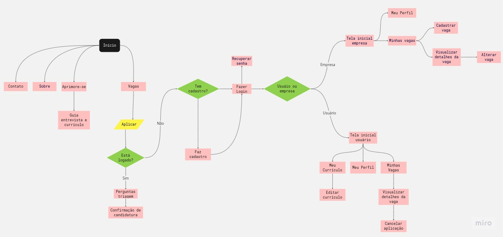

## Wireframes

A página inicial, bem como os links da barra de navegação, podem ser acessados por qualquer pessoa, tendo ou não cadastro na plataforma. Ela é constituída de um banner informativo e um destaque com as principais vagas do portal. Assim, a tela inicial atende ao requisito funcional (RF) **RF-003 - O sistema deve poder ser acessado por usuários não cadastrados.**

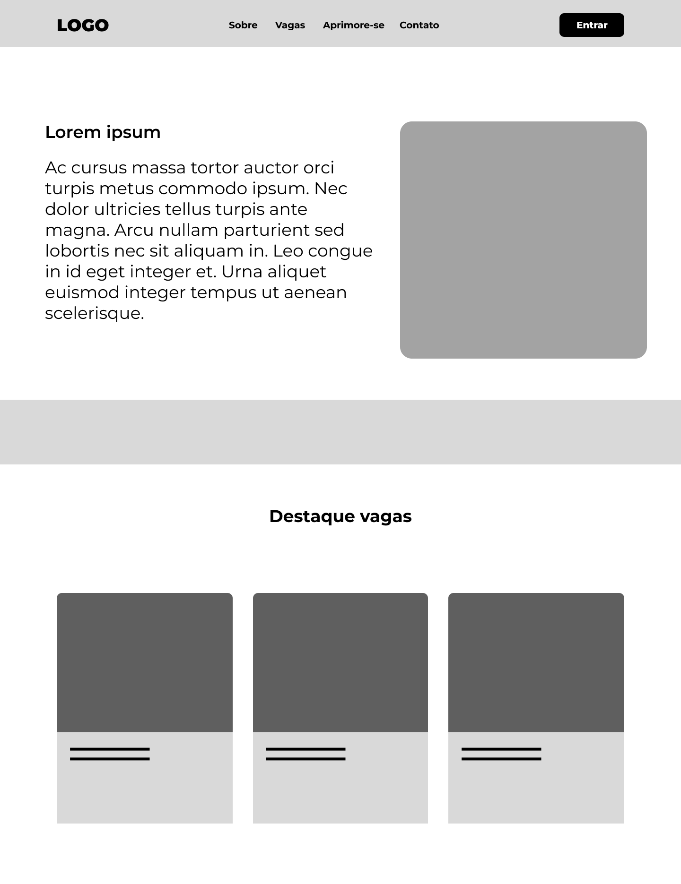

---

Ao acessar o link "Aprimore-se", o usuário ou visitante é levado a uma seção de ensino sobre a estrutura de um currículo e sobre a etapa de entrevista em processos seletivos, podendo navegar para tópicos de seu interesse através do menu lateral. Assim, essa tela atende ao **RF-002 - O sistema deve ter uma seção ensinando como estruturar um bom currículo**.

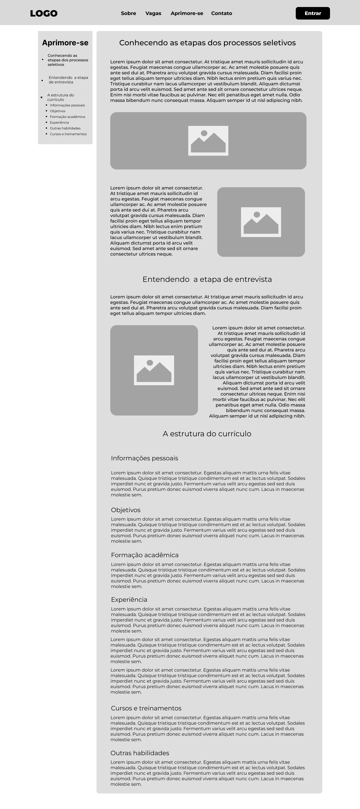

---

Pelo link "Vagas", o usuário ou visitante pode procurar por vagas de emprego disponíveis na plataforma, além de filtrar por palavra-chave ou localidade. Lá, ele verá os resultados em forma de cards com as principais informações a respeito das vagas. Com isso, essa tela atende ao **RF-010 - O sistema deve permitir que o usuário visitante pesquise uma vaga pelos parâmetros palavra-chave e localidade**. 

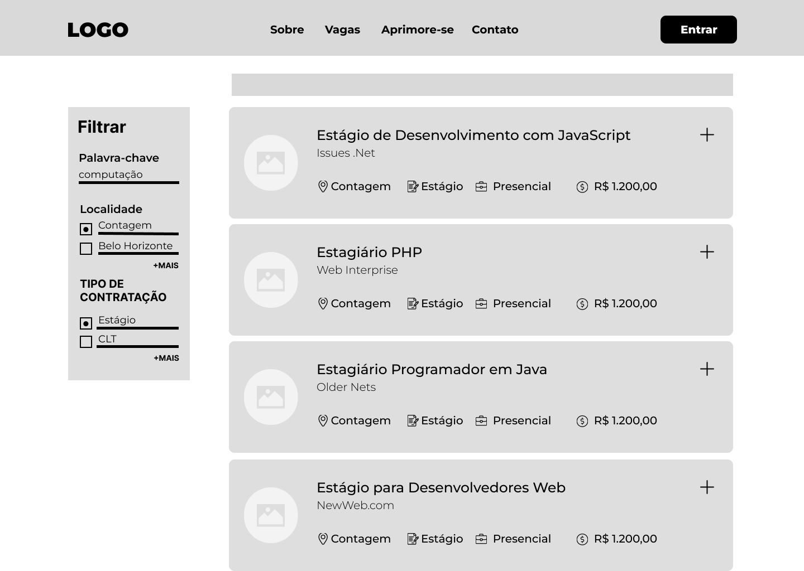

---

Para participar do processo seletivo, é necessário estar logado na plataforma.  Assim, o sistema retorna as informações profissionais do perfil do usuário, tendo ele apenas que responder a perguntas submetidas pelas empresas e confirmar o envio. Assim, atende ao **RF-005 - O sistema deve permitir que usuários cadastrados apliquem para as vagas de emprego disponíveis.**

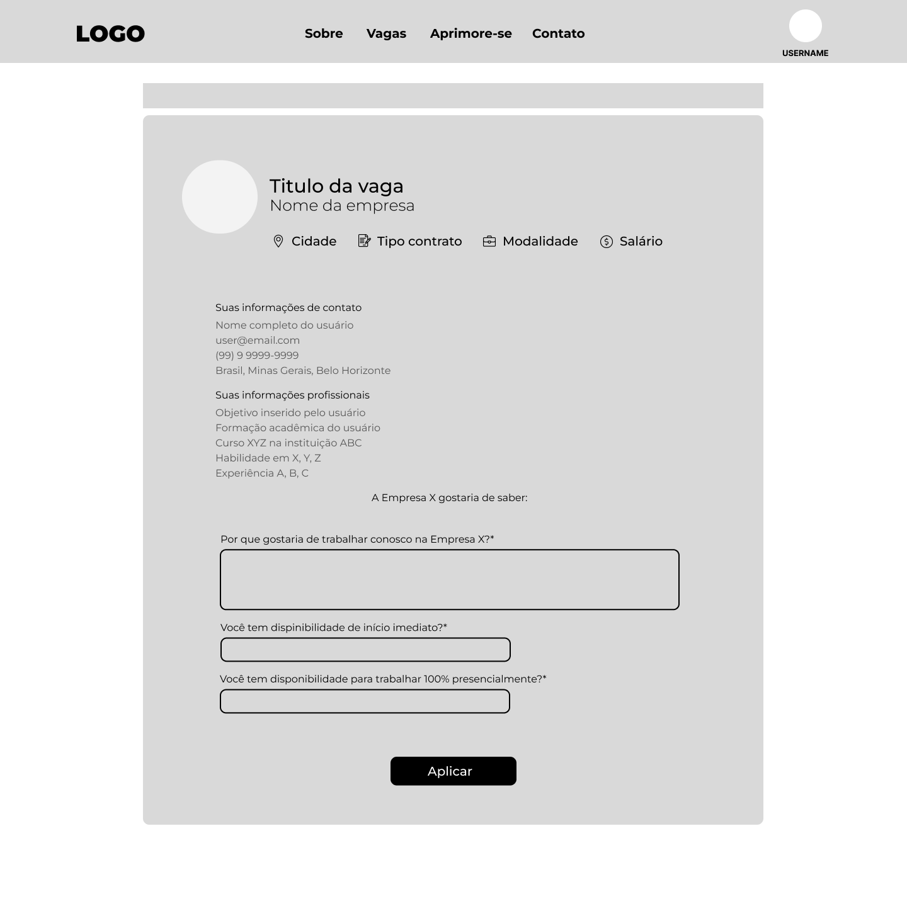

---

Os usuários podem acompanhar os processos dos quais estão participando pelo seu perfil. Esse histórico é mostrado como forma de cards contendo as principais informações sobre as vagas, para que o usuário tenha uma visão dinâmica dos seus processos. Essa tela atende ao **RF-6 - O sistema deve manter o histórico de aplicações dos usuários cadastrados**.

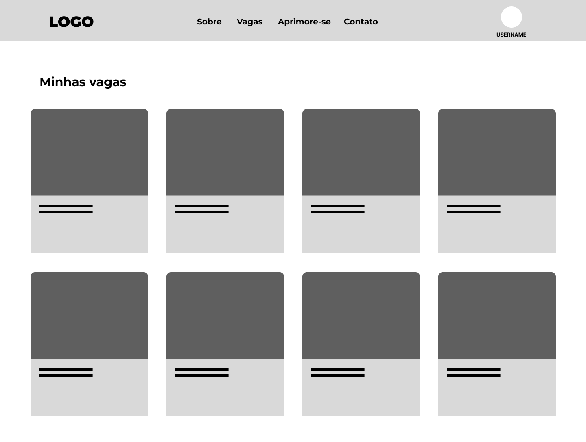

---

O usuário que está logado na plataforma pode também criar alertas para vagas conforme os termos que escolher. Essa tela atende ao **RF-11 - O sistema deve permitir que o usuário cadastrado possa criar alertas para uma vaga de seu desejo.**.

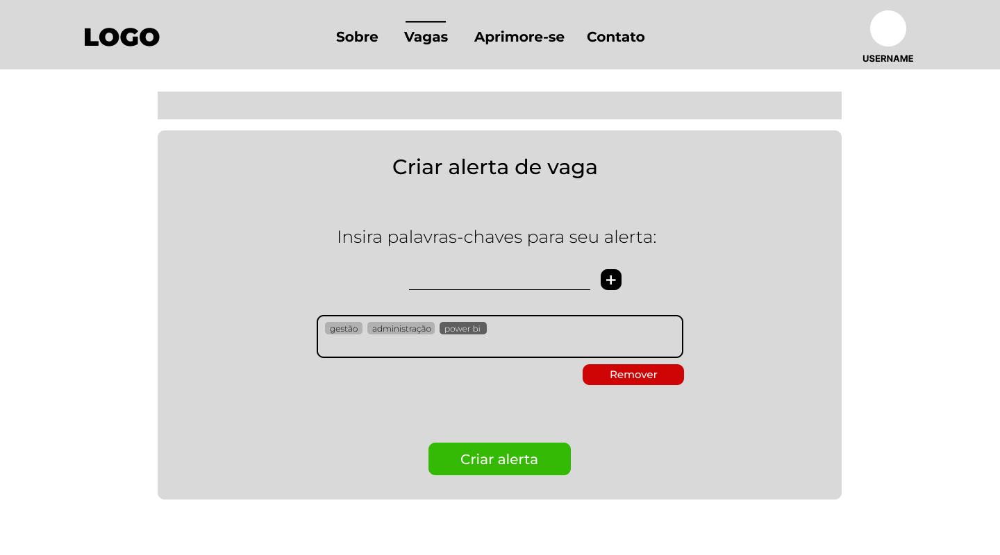

---

O usuário pode também alterar suas infomações de perfil, para que consiga manter suas informações profissionais atualizadas e continuar encontrando as vagas mais adequadas ao seu perfil. Essa tela atende ao **RF-013 - O sistema deve permitir que o usuário cadastrado altere os dados do seu perfil**.

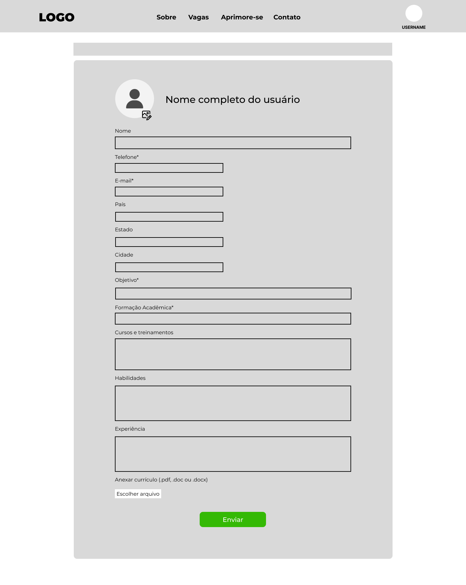

---

Para cadastros novos, foram desenvolvidos dois tipos de telas diferentes conforme o tipo de perfil - pessoa ou empresa -, buscando atender às características de cada um, isto é, solicitando informações básicas diferentes. Elas atendem ao **RF-001 - O sistema deve permitir que usuários e empresas cadastrados registrem-se e gerenciem suas contas**.

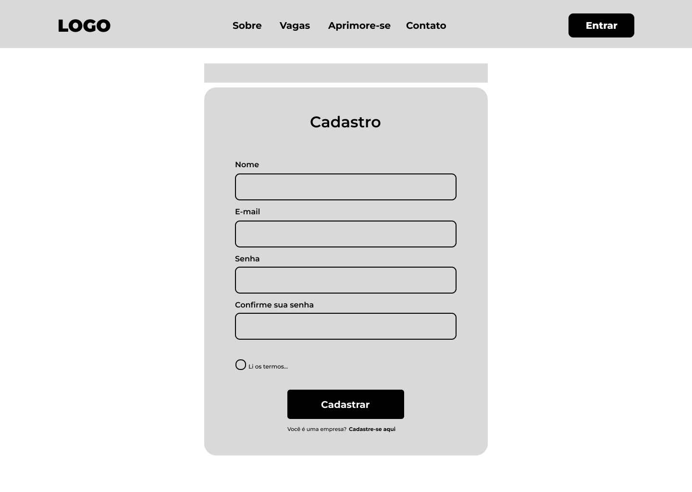

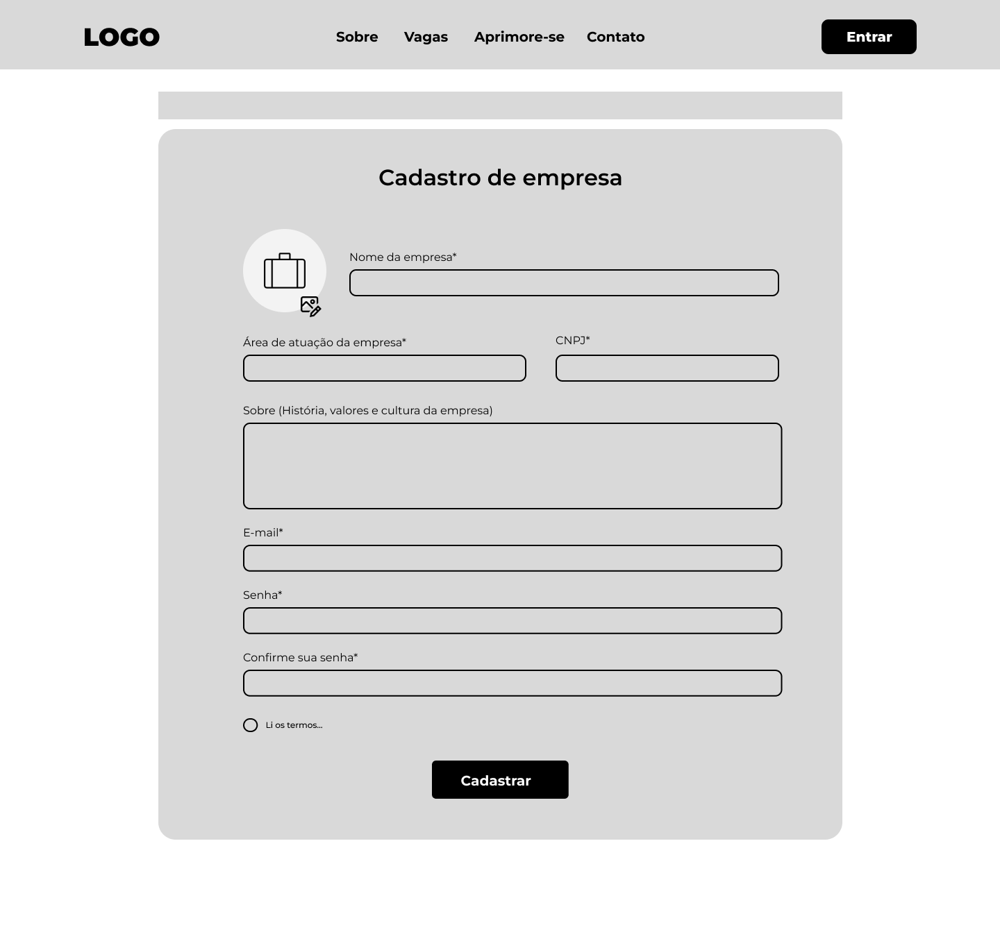

---

Em seu perfil, as empresas podem divulgar os processos em aberto, e fazer o gerenciamento dessas vagas. Ao iniciar o cadastro de uma nova vaga, o sistema determina seu status como "aberta". Essa tela atende aos **RF-004 - O sistema deve permitir que empresas criem e gerenciem vagas de emprego** e **RF-008 - O sistema deve definir o status "em aberto" quando uma nova vaga for cadastrada**.

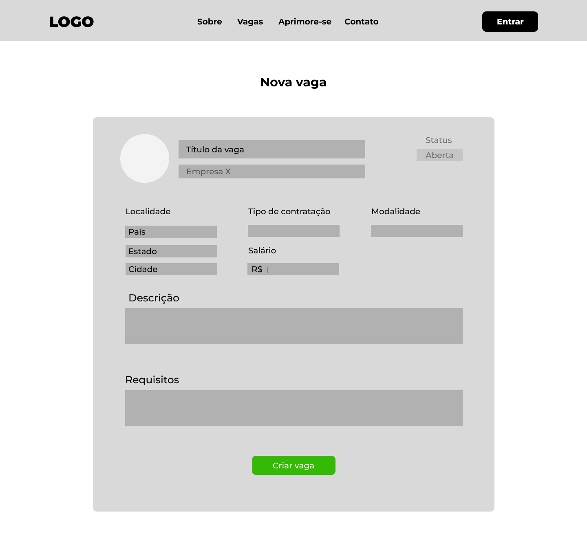

---

Os processos enviados pelas empresas são guardados em sua seção de vagas, que são mostradas como forma de cards contendo suas principais informações, para que se tenha uma visão dinâmica dos seus processos. Essa tela atende ao **RF-007 - O sistema deve manter o histórico de vagas submetidas pelas empresas**.

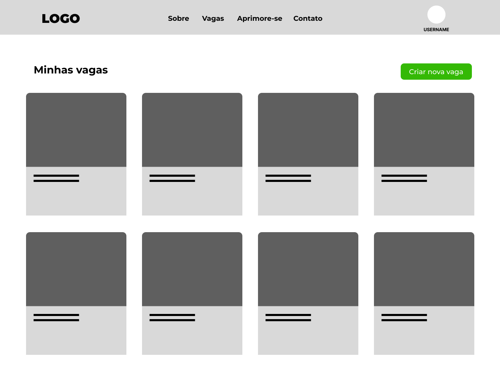

---

O recrutador pode alterar os detalhes das vagas, movimentar os candidatos participantes, além de fechar essas vagas. Essa tela atende ao **RF-009 - O sistema deve permitir que o recrutador altere o status das vagas para "fechada"**.

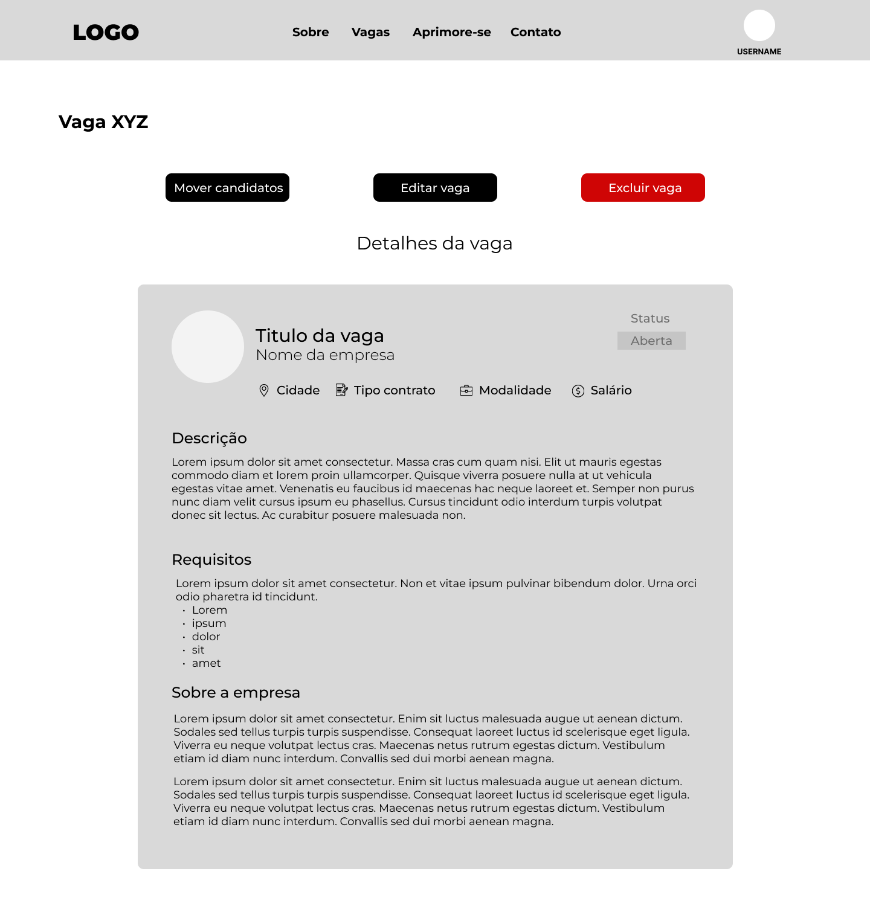

## Tabela relacional

A tabela abaixo faz uma relação entre as telas aqui mostradas e os requisitos funcionais que constam nas especificações.

| Tela | Requisito funcional|
|--- |----|
| Inicial|RF-003 - O sistema deve poder ser acessado por usuários não cadastrados.|
| Aprimore-se | RF-002 - O sistema deve ter uma seção ensinando como estruturar um bom currículo. |
| Cadastro de usuário / Cadastro de empresa |RF-001 - O sistema deve permitir que usuários e empresas cadastrados registrem-se e gerenciem suas contas|
| Alteração de perfil de usuário |RF-013 - O sistema deve permitir que o usuário cadastrado altere os dados do seu perfil|
| Alteração de perfil de empresa |RF-0|
| Vagas |RF-010 - O sistema deve permitir que o usuário visitante pesquise uma vaga pelos parâmetros palavra-chave e localidade|
| Aplicar para vaga|RF-005 - O sistema deve permitir que usuários cadastrados apliquem para as vagas de emprego disponíveis.|
|Histórico de aplicações |RF-6 - O sistema deve manter o histórico de aplicações dos usuários cadastrados|
| Histórico de vagas da empresa | RF-007 - O sistema deve manter o histórico de vagas submetidas pelas empresas |
|Alerta de vaga|RF-11 - O sistema deve permitir que o usuário cadastrado possa criar alertas para uma vaga de seu desejo.|
| Nova vaga|RF-004 - O sistema deve permitir que empresas criem e gerenciem vagas de emprego / RF-008 - O sistema deve definir o status "em aberto" quando uma nova vaga for cadastrada*|
| Alteração de vaga|RF-009 - O sistema deve permitir que o recrutador altere o status das vagas para "fechada"|