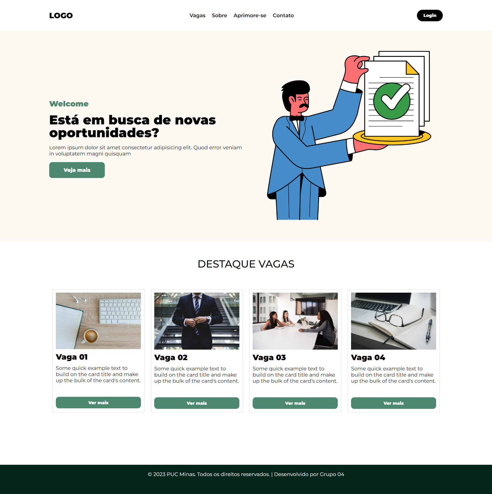
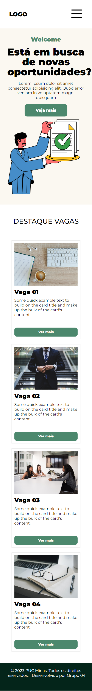
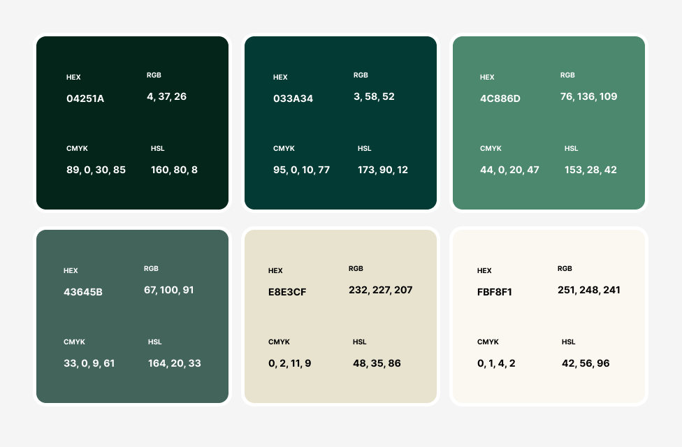
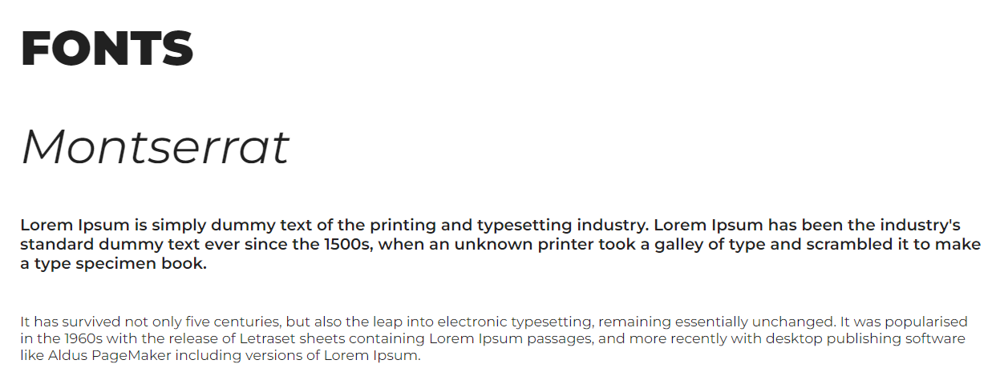
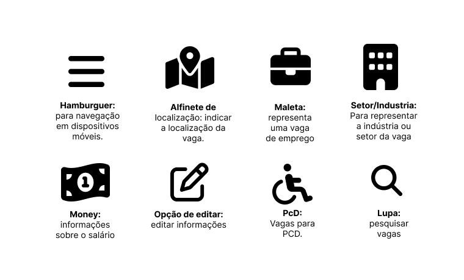

# Template padrão do site

Layout padrão do site (HTML e CSS) que será utilizado em todas as páginas com a definição de identidade visual, aspectos de responsividade e iconografia.

Explique as guias de estilo utilizadas no seu projeto.

## Design

O design do nosso site de vagas é pensado para oferecer uma experiência atraente e funcional aos usuários, garantindo que eles possam acessar facilmente informações sobre oportunidades de emprego, candidatura e detalhes relacionados. Além disso, o site é responsivo, o que significa que é adaptável a diferentes dispositivos e tamanhos de tela, proporcionando uma experiência consistente em smartphones, tablets e desktops. O design do site apresenta um layout limpo e organizado, com uma disposição lógica de elementos. Utilizamos uma paleta de cores agradável e harmoniosa que reflete a identidade da marca e cria uma atmosfera profissional e convidativa.

## Cores

A escolha dos tons de verde na criação do site foi estratégica e significativa por várias razões. O verde é comumente associado à natureza, vegetação e paisagens serenas, o que permite transmitir uma sensação de calma e tranquilidade aos usuários, um elemento essencial em um site de vagas, onde os candidatos frequentemente buscam oportunidades de emprego em um ambiente estressante. Além disso, o verde evoca conceitos de renovação e crescimento, reforçando a ideia de desenvolvimento pessoal e profissional. A sua característica de ser relaxante para os olhos também aprimora a legibilidade do conteúdo do site, proporcionando uma experiência mais agradável aos visitantes.

Apresente a paleta de cores que será utilizada. Uma ferramenta interessante para a criação de palestas de cores é o *Adobe Color* ([https://color.adobe.com/pt/create/color-wheel](https://color.adobe.com/pt/create/color-wheel)).

## Tipografia

A fonte escolhida para utilização em todo o site foi a Montserrat, disponibilizada pela Google. A Montserrat é uma fonte moderna e elegante, conhecida por sua legibilidade e versatilidade, o que a torna uma escolha sólida para a comunicação de informações importantes. Ela possui uma variedade de pesos (do mais fino ao mais negrito) e estilos (normal, itálico, etc.), que podem ser utilizados para criar hierarquia e ênfase no conteúdo do site. Sua aparência limpa e contemporânea combina bem com a sensação de profissionalismo que um site de vagas deseja transmitir aos seus usuários.

Apresente as fontes que serão utilizadas e sua função no site. As principais funções são: Título de página, Título de Seção, Rótulos de componentes e Corpo de Texto.

## Iconografia

Escolhemos o Font Awesome  por possuir uma vasta biblioteca de ícones e a facilidade de implementação. Abrangendo desde ícones básicos e universais até ícones altamente específicos de nichos e setores, atendendo às necessidades do nosso design de maneira abrangente.

> **Links Úteis**:
>
> -  [Como criar um guia de estilo de design da Web](https://edrodrigues.com.br/blog/como-criar-um-guia-de-estilo-de-design-da-web/#)
> - [CSS Website Layout (W3Schools)](https://www.w3schools.com/css/css_website_layout.asp)
> - [Website Page Layouts](http://www.cellbiol.com/bioinformatics_web_development/chapter-3-your-first-web-page-learning-html-and-css/website-page-layouts/)
> - [Perfect Liquid Layout](https://matthewjamestaylor.com/perfect-liquid-layouts)
> - [How and Why Icons Improve Your Web Design](https://usabilla.com/blog/how-and-why-icons-improve-you-web-design/)